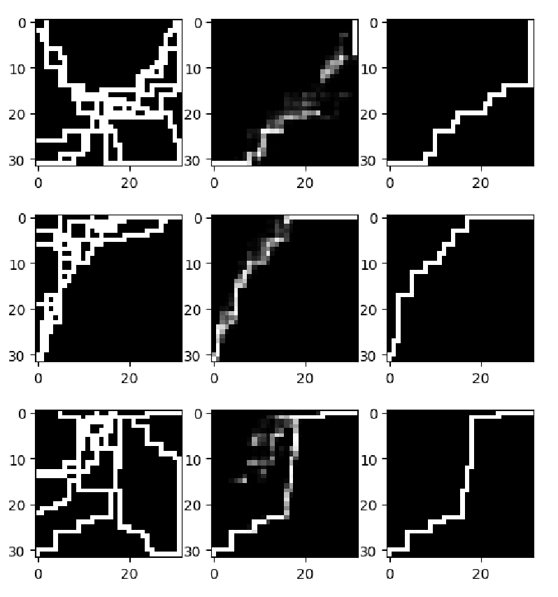

# Auto Encoder CNN for Maze Path Finding

* **leftmost column shows the mazes**
* **the middle column are the approximation of solution**
* **the rightmost column shows the true solutions**

- **Summary**: This project, part of EE456 at Penn State, involved implementing and testing an Auto Encoder Convolutional Neural Network (CNN) to solve a maze path finding problem. The goal was to find a path from the bottom left to the top right corner of a maze represented as an image.

- **Tools Used**: The project extensively used Python 3.8.15 with libraries such as torch, torchvision, matplotlib, and numpy in an Anaconda environment.

## File Descriptions

1. **`temp.ipynb`**: A Jupyter notebook containing the initial experiments and tests conducted during the early stages of the project. It includes exploratory data analysis and preliminary model training.

2. **`generateData.ipynb`**: This notebook is responsible for generating the maze data used for training the Auto Encoder. It outlines the process of creating 10,000 unique mazes and their corresponding solution paths.

3. **`AutoEncoderNet.ipynb`**: This file contains the complete implementation of the Auto Encoder CNN, including the architecture definition, training process, and testing on generated maze data.

4. **`FinalProject_EfeSahin.pdf`**: Comprehensive documentation of the project covering the objective, methodology, neural network architecture, results, and conclusions. It also includes visual representations of training progress and the final results.

5. **`EE456Final Project.mp4`**: A video presentation of the project, illustrating the working of the Auto Encoder CNN in solving the maze problems and showcasing the project's outcomes.

_The project demonstrates the effectiveness of an Auto Encoder CNN in solving path finding problems in mazes, highlighting the capability of neural networks in feature extraction and image reconstruction._

Here are links to my other work in EE456

1. Implemented with pytorch: [cifar-cnn](https://github.com/Efesasa0/cifar-cnn.git)
2. Implemented with MatLAB: [mlp-backprop](https://github.com/Efesasa0/mlp-backprop-two-moons.git)
